# Analytics of Home Mortgage Disclosure Act (HMDA) Mortgage Dataset (New York State, 2024)

## Introduction and dataset description

The Home Mortgage Disclosure Act (HMDA) is a U.S. official dataset that provides comprehensive information regarding the U.S. housing mortgage market, disclosed by many financial institutions [(Source)](https://www.consumerfinance.gov/data-research/hmda/). In this project, we have analyzed the many characteristics that could affect loan application results, using the data for New York State over the year of 2024.
Each observation represents a loan application, including borrower characteristics, loan attributes, and application outcome. The dataset contains three main categories of information: the first is basic applicant information (race, gender, age, region); the second is financial information, such as interest rates, loan amounts, and income; and the third is approval-related information and product structure variables, such as loan type and loan purpose.

## Data acquisition methodology

The dataset was downloaded from the [HMDA data browser](https://ffiec.cfpb.gov/data-browser/data/2024?category=states) with New York State and year 2024 selected. The original dataset included 383,577 rows and 99 columns.

## Cleaning and preprocessing steps

We referred to the explanation of data for each field according to [Public HMDA - LAR Data Fields](https://ffiec.cfpb.gov/documentation/publications/loan-level-datasets/lar-data-fields).

For how we have treated each of the 99 columns, including the selected data dropping and remapping, please refer to [`HMDA_NY_2024_data_overview.pdf`](https://github.com/zeeliu7/hmda-ny-2024-analytics/blob/main/HMDA_NY_2024_data_overview.pdf).

### Dropping features

20 features were dropped initially due to the following reasons:

| Reason | Number of Affected Features | Example |
|:------:|:---------------------------:|:-------:|
| Identification number or shared feature | 5 | `activity_year` |
| Minimal contribution to analysis | 4 | `applicant_credit_score_type` |
| Too many missing values | 11 | `total_points_and_fees` |

### Exempt data removal

For the remaining features, many data included exempt categories that would not benefit our analysis. As a result, we removed rows that includes exempt data.

Example:

```
loan_purpose
Values:
1 - Home purchase
2 - Home improvement
31 - Refinancing
32 - Cash-out refinancing
4 - Other purpose
5 - Not applicable
```

Code:
```python
df = df[~df['loan_purpose'].astype(str).isin(['5'])]
```

### Relabelling

For categorical features, the original data usually included a numerical code, and we converted them to readable format and better for further one-hot encoding column naming. For data initially as text, we have refined the text by replacing non-alphanumerical characters to underline for a more machine-friendly format.

Example:

```python
df['action_taken'] = df['action_taken'].astype(str).map({
    "1": "Loan_originated",
    "2": "Application_approved_but_not_accepted",
    "3": "Application_denied",
    "4": "Application_withdrawn_by_applicant",
    "5": "File_closed_for_incompleteness",
    "6": "Purchased_loan",
    "7": "Preapproval_request_denied",
    "8": "Preapproval_request_approved_but_not_accepted"
})
```

### Boolean conversion

Certain categories were categorical but only with two categories each. We have converted the data into boolean. This was helpful for filtering since boolean checking is faster than string matching.

Example:

```
Before:
preapproval
1 - Preapproval requested
2 - Preapproval not requested

After:
preapproval_requested (True/False)
```

### From combined feature to one-hot encoding

A couple features were initially in a combined format. The following is an example, and the original dataset included `applicant_ethnicity-1` through `applicant_ethnicity-5`:

```
applicant_ethnicity-1
1 - Hispanic or Latino
11 - Mexican
12 - Puerto Rican
13 - Cuban
14 - Other Hispanic or Latino
2 - Not Hispanic or Latino
3 - Information not provided by applicant in mail, internet, or telephone application
4 - Not applicable
```

We collected the appearance of any category listed and converted them to a boolean feature, such as `applicant_ethnicity_is_Mexican` (True/False). For example, if an applicant has selected 1, 11, and 12, the row of data will set the related three columns to True. This one-hot encoding of ethnicity ensures high machine performance over combined data.

### End result

The final dataset included 216,635 rows and 123 columns.

## Exploratory Data Analysis (EDA)

The Exploratory Data Analysis begins with an examination of the core financial variables to understand their statistical properties, distributional shapes, and potential implications for downstream modeling. The dataset contains 216,635 observations and 123 variables, providing a sufficiently large sample to derive reliable statistical insights while also increading the likelihood of extreme values and structural irregularities. 

### 1) Core Financial Variables Distribution
<div style="display: flex; flex-wrap: wrap; justify-content: center; gap: 20px;">

  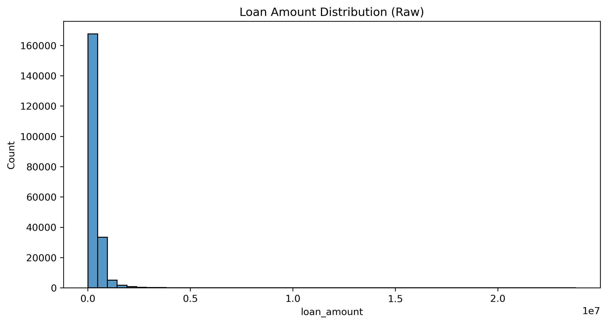
  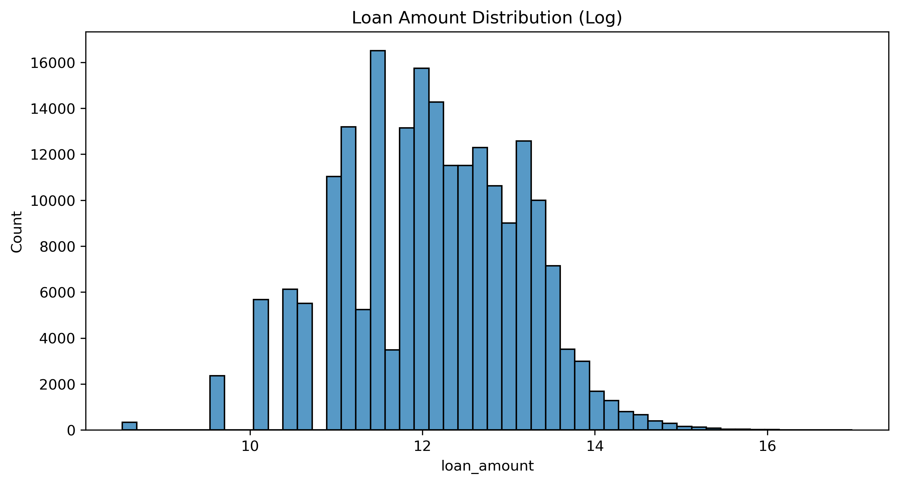
  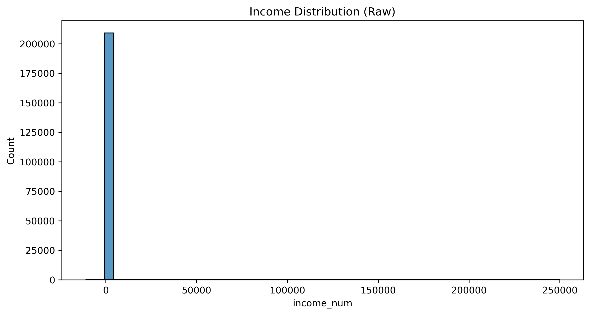
  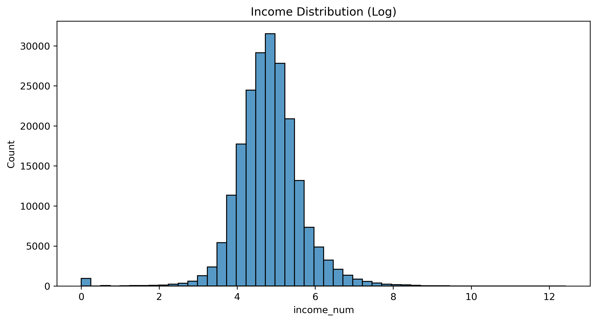

</div>
The distribution analysis of key financial variables reveals substantial heterogeneity, skewness, and structural patterns that directly inform preprocessing decisions. According to above figures, monetary vairables including loan amount, income and property values, exhibit pronounced right skewness in their raw form. The presence of extreme upper-tail observations is evident in both visual inspection and summary statistics. Logarithmic transformation was therefore applied to these variables to stabilize variance and improve interpretability. In log space, the distributions become more symmetric, and the heavy skewed behavior is reduced, making them more suitable for modeling frameworks that assume approximate linear relationships.

<div style="display: flex; flex-wrap: wrap; justify-content: center; gap: 20px;">

  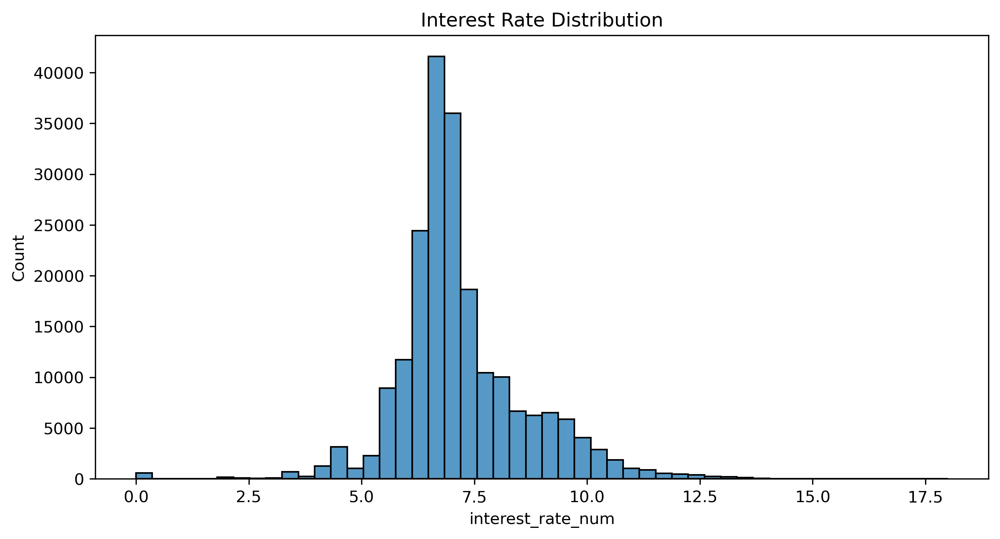
  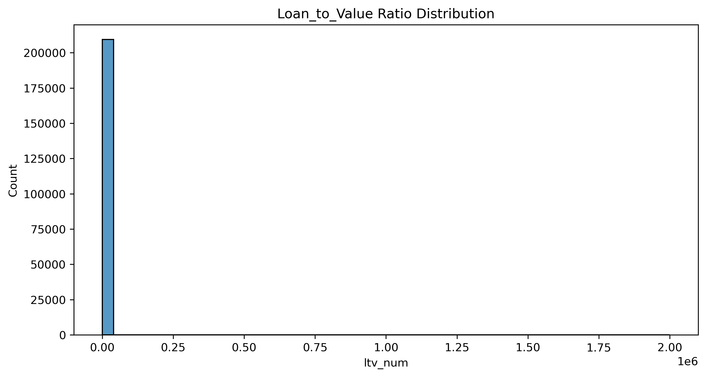
  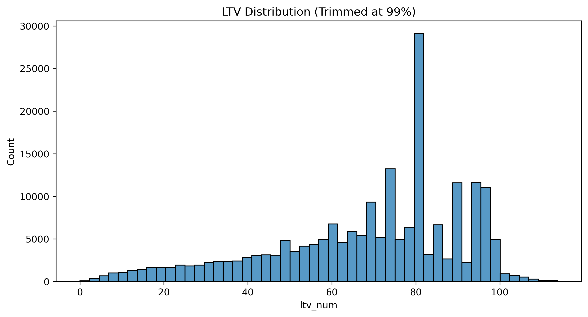
  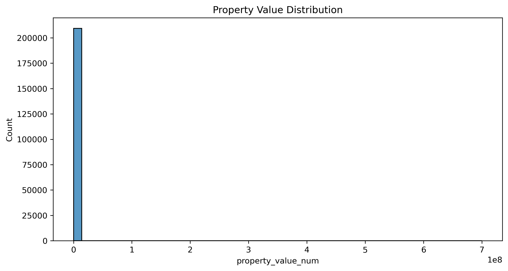
  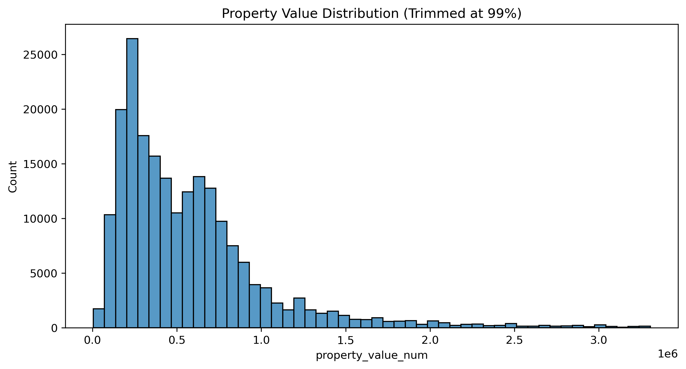
  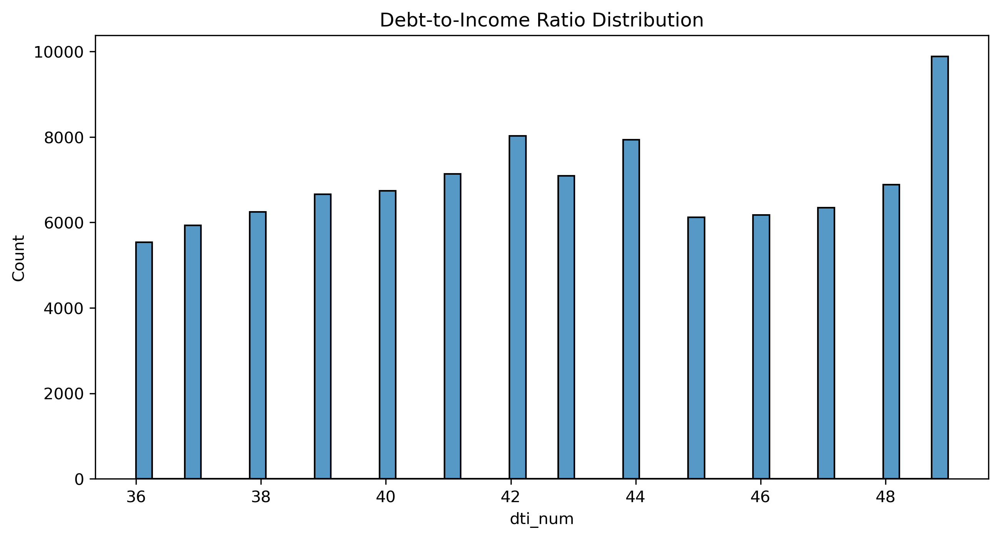

</div>
According to the above figures, interest rate displys moderate dispersion, with central tendencies around 6.8 - 7.5%. Unlike monetary magnitudes, it does not exhibit extreme skewness. However, differences between approved and denied groups indicate that interest rate reflects risk-based pricing mechanisms. Loan-to-value ratio and property value presents structural anomalies in raw form, including implausibly large values, which were addressed through trimming. After cleaning, LTV and property value clusters within economically plausible ranges.

Debt-to-income ration shows relatively tight clustering around the lower 40% range for both approved and denied groups. The narrow distribution suggests that underwriting thresholds may constrain this variable within a regulatory band, limiting its linear explanatory power in isolation.

Overall, the financial magnitude variables required transformation due to skewness, while leverage related metrics required trimming due to extreme values. These adjustments ensure statistical stability in subsequent analysis.

### 2) Approval Analysis
The dataset contains 156,349 approved applications and 53,020 denied applications, corresponding to an approval rate of approximately 75%. 
<div style="display: flex; flex-wrap: wrap; justify-content: center; gap: 20px;">

  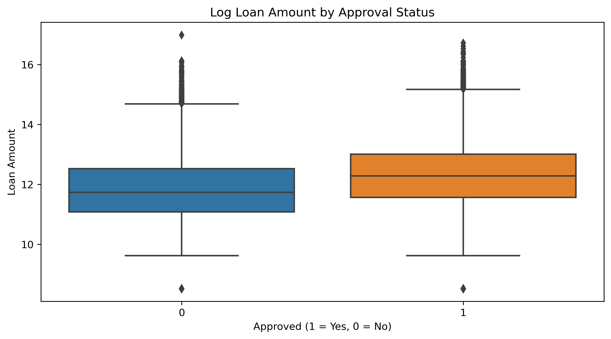
  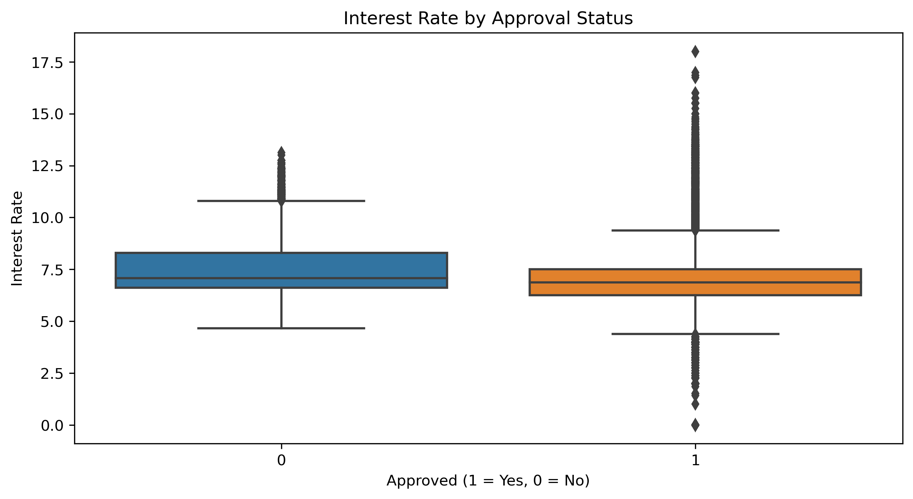
  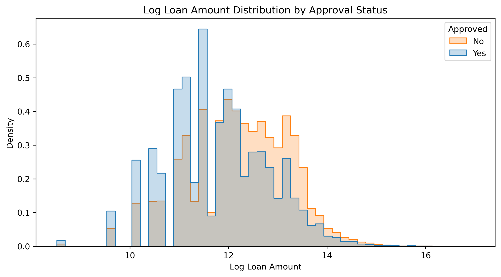

</div>
According to above figures, even after the log transformation, the boxplots indicate mild positive skewness in both approved and denied groups, with a noticeable concentration of high-value outliers in the upper tail. These extreme observations likely correspond to unusually large mortgage loans and may exert leverage in regression modeling if not handled appropriately. Importantly, the median log loan amount is higher for approved applications than for denied ones, suggesting that larger requested loan amounts are not necessarily associated with higher rejection probability; instead, approval decisions may be more closely tied to borrower creditworthiness or underwriting criteria rather than size alone.

Regarding interest rates, the distributions appear moderately right skewed, particularly among approved loans, where a wider dispersion and more extreme high rate outliers are visible. The presence of several low rate outliers (near zero) may reflect special loan products, reporting anomalies, or data recording issues that warrant verification. Although median interest rates for approved and denied groups are relatively similar, the variability is greater among approved loans, potentially reflecting risk based pricing practices. Overall, while both loan amount and interest rate display skewness and heavy tails, the log transformation substantially improves the symmetry of loan amount distributions. The persistence of outliers suggests the importance of robust modeling approaches or sensitivity analysis in subsequent regression or predictive modeling steps.

### 3) Demographic Group Analysis
<div style="display: flex; flex-wrap: wrap; justify-content: center; gap: 20px;">

  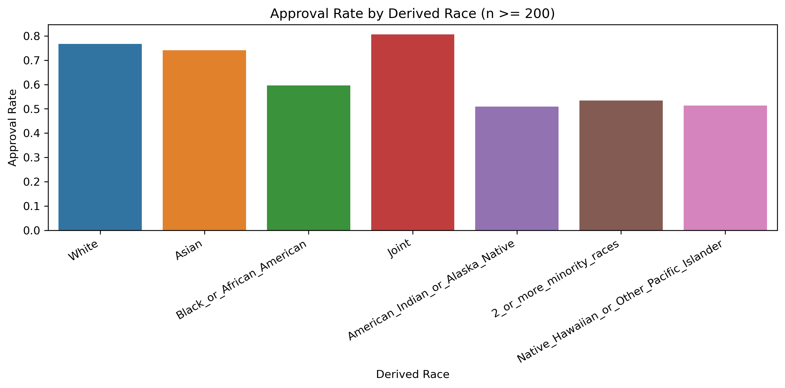
  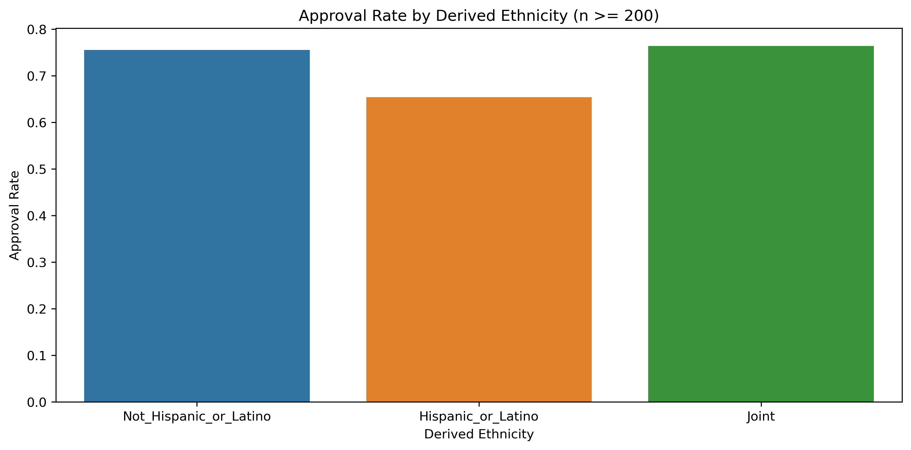
  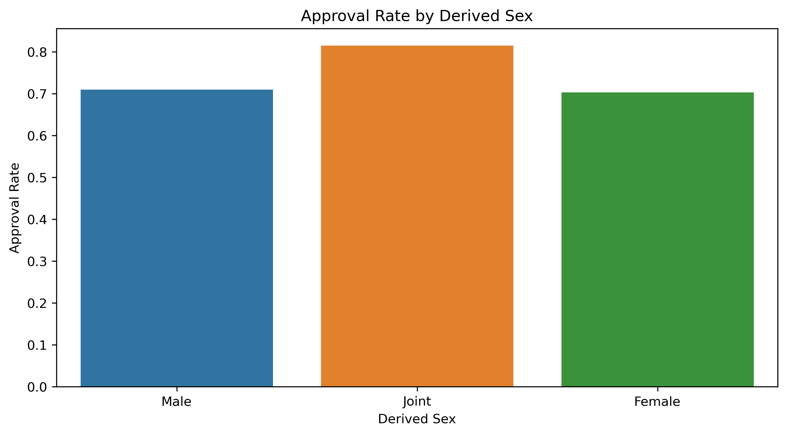
  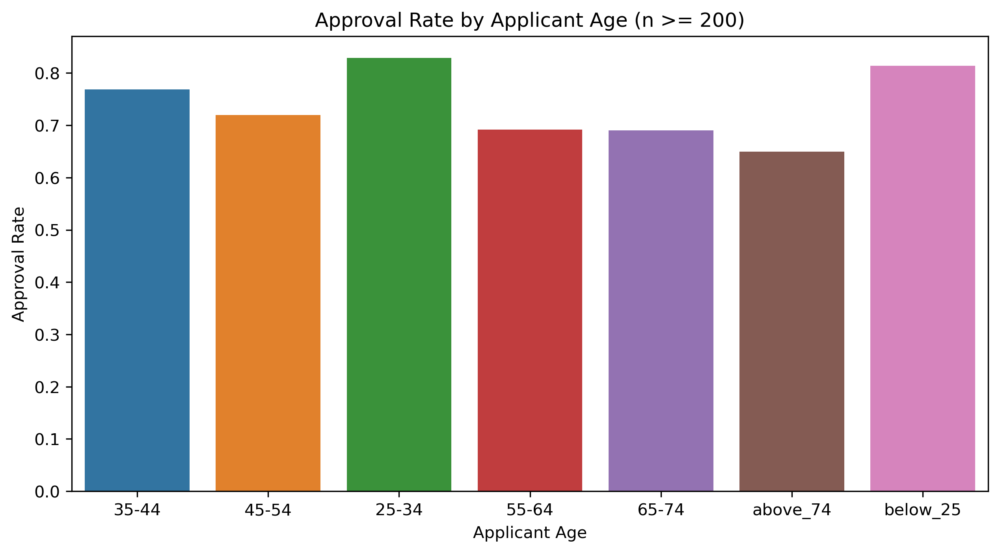

</div>
The demographic analysis reveals substantial variation in approval rates across racial groups. White applicants constitute the majority of observations (n = 161,135) and exhibit an approval rate of approximately 76.8%, slightly above the overall average. Asian applicants show a comparable rate (74.1%), while Black or African American applicants experience a materially lower approval rate (59.6%). Approval rates for American Indian or Alaska Native (50.9%), Native Hawaiian or Other Pacific Islander (51.4%), and applicants identifying with two or more minority races (53.4%) are also notably lower. Although smaller sample sizes characterize some minority groups, the consistent gap of roughly 15–25 percentage points relative to White applicants suggests meaningful disparities that warrant further multivariate analysis to determine whether these differences persist after controlling for financial characteristics.

A similar pattern emerges in the ethnicity breakdown. Not Hispanic or Latino applicants (n = 186,000) have an approval rate of 75.6%, compared to 65.4% among Hispanic or Latino applicants, representing a gap of roughly 10 percentage points. Applicants reporting joint ethnicity show a slightly higher approval rate (76.4%), though this group is smaller in size. With respect to sex, male and female applicants exhibit nearly identical approval rates (approximately 70.9% and 70.3%, respectively), suggesting limited gender-based disparity at the aggregate level. However, applications classified as “Joint” (likely co-applicants) show a markedly higher approval rate (81.5%), potentially reflecting stronger combined income, credit profiles, or collateral strength.

Age based patterns indicate a non-linear relationship between applicant age and approval probability. Younger applicants (25–34 and below 25) demonstrate the highest approval rates (82.9% and 81.4%, respectively), while approval rates gradually decline for older cohorts, reaching 64.9% among applicants above 74. Middle aged groups (35–44 and 45–54) fall between these extremes. This inverted 'U shape' pattern may reflect lifecycle income dynamics, employment stability, or underwriting considerations related to retirement and long term repayment capacity. Overall, the demographic analysis suggests observable disparities across race and ethnicity and age-related variation, underscoring the importance of conducting controlled regression analysis to distinguish structural differences from compositional effects driven by financial variables.

### 4) Financial Relationship Analysis
<div style="display: flex; flex-wrap: wrap; justify-content: center; gap: 20px;">

  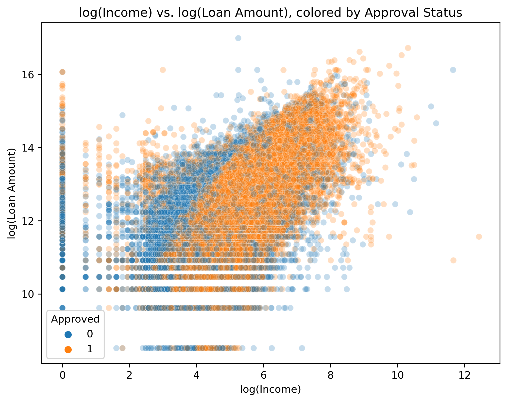
  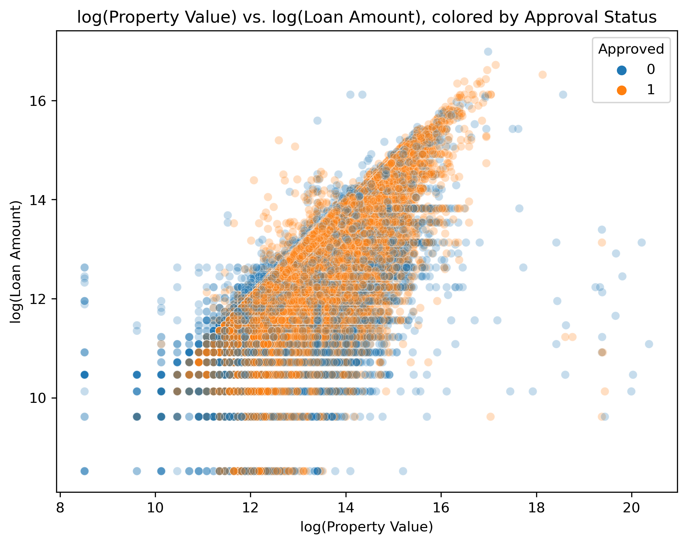

</div>
According to above figures, the financial relationship analysis shows strong and economically intuitive patterns between borrower characteristics and approval outcomes. First, both the scatterplots and summary statistics indicate a clear positive relationship between log_income and log_loan amount, suggesting proportional scaling consistent with underwriting standards. Approved applications cluster more densely in the higher income and higher loan region, indicating that stronger income profiles support larger borrowing capacity. The following Table 1 also confirms this pattern: approved applicants have substantially higher mean and median income (mean $\approx$ 197.9 vs. 153.5; median 130 vs. 96) compared to denied applicants. This suggests income is a key determinant of approval, consistent with credit risk assessment frameworks that prioritize repayment capacity.

=== Table 1: Income & Property Characteristics (by approved) ===
|   approved |   income_num_mean |   income_num_median |   property_value_num_mean |   property_value_num_median |
|-----------:|------------------:|--------------------:|--------------------------:|----------------------------:|
|          0 |            153.52 |                  96 |                    774339 |                      525000 |
|          1 |            197.88 |                 130 |                    620680 |                      455000 |

The relationship between property value and loan amount is even more structurally linear, reflecting collateral based lending dynamics. The log–log scatterplot shows a tight positive slope pattern, indicating that loan size scales strongly with property value. Interestingly, denied applications exhibit higher average property values (mean $\approx$ 774k vs. 621k according to Table 1), while also showing much higher average loan-to-value (LTV) ratios (mean $\approx$ 127.7% vs. 70.0%) according to the following Table 2. This suggests that denial decisions may be driven less by absolute property value and more by leverage intensity. Extremely high LTV ratios among denied applicants imply greater credit risk exposure, which likely triggers underwriting rejections despite large collateral values. Thus, leverage rather than asset size appears to be a critical risk factor.

=== Table 2: Interest Rate & LTV (by approved) ===
|   approved |   interest_rate_num_mean |   interest_rate_num_median |   ltv_num_mean |   ltv_num_median |
|-----------:|-------------------------:|---------------------------:|---------------:|-----------------:|
|          0 |                     7.52 |                       7.08 |         127.74 |            71.17 |
|          1 |                     7.06 |                       6.88 |          70.03 |            75    |

Interest rate and pricing variables further reinforce risk differentiation. Denied applications display slightly higher average interest rates (7.52% vs. 7.06%) and substantially higher average rate spreads (0.73 vs. 0.41, according to the following Table 3), suggesting that riskier borrower profiles are priced more aggressively. Debt-to-income (DTI) ratios are broadly similar across groups (both around 43% median), though the lower observation count for DTI among denied applications may indicate missing or incomplete documentation issues. Overall, the financial analysis suggests that approval is strongly associated with higher income, lower leverage (LTV), and more favorable pricing terms. Among all financial variables, LTV and income appear to exhibit the strongest structural separation between approved and denied applications, implying that capital structure risk and repayment capacity are primary drivers of lending decisions.

=== Table 3: Risk Metrics (DTI & Rate Spread) (by approved) ===
|   approved |   dti_num_mean |   dti_num_median |   rate_spread_num_mean |   rate_spread_num_median |
|-----------:|---------------:|-----------------:|-----------------------:|-------------------------:|
|          0 |          42.95 |               43 |                   0.73 |                     0.3  |
|          1 |          42.81 |               43 |                   0.41 |                     0.33 |

### 5) Correlation Matrix Analysis
The following figure is the Correlation Heatmap. 
<div align="center">
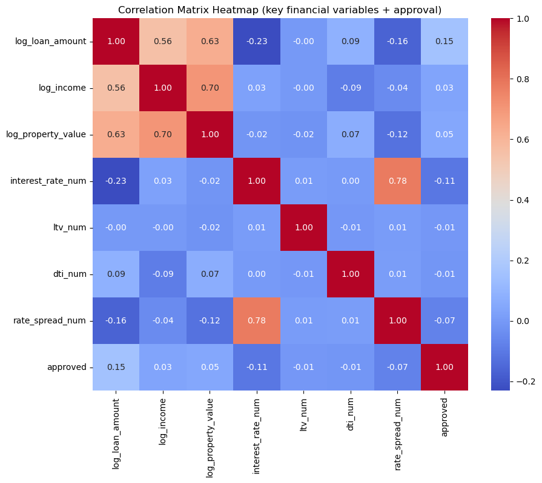
</div>
The correlation matrix highlights several key structural relationships. log_loan_amount shows moderate positive correlation with log_income (0.56) and log_property value (0.63), while log_income and log_property value exhibit a strong correlation of 0.70. These relationships reflect underlying economic capacity and wealth linkages.

Interest rate and rate spread display a strong positive correlation (0.78), suggesting that these variables capture closely related pricing information. Including both in a linear model may introduce multicollinearity concerns, warranting feature selection or regularization.

Correlations between approval and individual financial variables are relatively modest. The strongest positive correlation with approval is observed for log_loan amount (0.15), while interest rate shows a small negative relationship (-0.11). LTV and DTI exhibit almost a zero linear correlations with approval in aggregate, implying that their influence may be nonlinear or threshold driven rather than strictly linear.

The overall correlation structure suggests that approval decisions are driven by multivariate interactions rather than dominant single variable effects, supporting the need for modeling approaches capable of capturing combined financial risk dynamics.

## Feature engineering process and justification

We divided feature engineering into two parts. The first part focuses on basic feature transformations and binary normalization. The second part involves creating additional columns that may be useful for later analysis. 

### 1) Basic feature transformations 
After reviewing the cleaned dataset, We found that many variables were stored as boolean values (True/False), similar to “denial_reason_is_Debt-to-income_ratio.” Therefore, these boolean indicators were first converted into a standardized binary format (0/1). A large number of missing values (NaN) was also observed in categorical variables related to co-applicants. By cross-checking with other co-applicant fields (e.g cases where co_applicant_age = 9999 indicates no co-applicant), it was validated that blanks in these co-applicant category fields are more consistent with the presence of a co-applicant whose demographic information is missing, rather than the absence of a co-applicant. Therefore, a new binary indicator variable was constructed to identify whether an application includes a co-applicant.

Secondly, we created a binary approval indicator  to distinguish applications that resulted in an originated loan from those that did not. Applications that were approved but not accepted were treated as not approved, since no loan was ultimately issued. This definition helps ensure consistency in downstream analysis. Moreover, we encoded Several variables with predefined categories. For example, loan_type contains only four categories, the race/ethnicity fields for the applicant and co-applicant use fixed category codes, and applicant age is already provided in grouped ranges. Encoding these categorical features (one-hot encoding) makes it easier to examine whether demographic and product-related attributes are associated with application outcomes.

### 2) Create additional useful columns
First, we applied KNN imputation to fill missing values in variables such as loan_to_value_ratio, interest_rate, rate_spread, and property_value to support subsequent calculations. In contrast, loan_term typically takes discrete integer values (e.g., 360 or 180), with 360 dominating the distribution. Because KNN imputation could produce unrealistic intermediate values for this discrete feature, it is not appropriate for filling missing loan terms. Instead, mode imputation is a more suitable choice.

example for loan type:
```
loan_type
Conventional             195259
FHA_insured               16469
VA_guaranteed              4608
RHS_or_FSA_guaranteed       299
Name: count, dtype: int64
```
Then, we construct important financial indicators such as loan to income (Loan Amount/Income), equity (Property Value - Loan Amount), and equity_ratio (Equity/Property Value) for subsequent analysis.

Formulat:

$$
P \cdot r \cdot (1+r)^n / ((1+r)^n - 1)
$$


Since an individual’s deviation from local market conditions may also be informative, we created three county-relative features: interest_rate_minus_county_median (whether the interest rate is above the county median), property_value_minus_county_median (whether the property value is above the county median), and income_minus_county_median (whether income is above the county median). These variables capture how each application compares to the typical level in its local market and support scenario-based analysis.Finally, we calculate the z-score for all values to facilitate computation.

## Summary of key findings

* EDA shows strong skewness in key financial variables. Loan amount, income, property value, and interest rate are right-skewed.

* Approved loans tend to have higher income and lower interest rate / rate spread, while denied loans show higher leverage.

* Approval rates vary by race/ethnicity/sex/age (e.g., higher for White/Asian than Black/American Indian, lower at older ages.

* `debt_to_income_ratio` quantiles are centered around **36–49** (e.g., median **43**, 95th/99th **49**), indicating limited variability after filtering.

* Compared with approved cases, denied cases have lower income (median **96** vs **130**) and higher interest rates (median **7.080** vs **6.875**).

## Challenges faced and future recommendations

### Challenges:

* **Inconsistent exempt coding across features**: While storing categorical data as numbers is storage-efficient, exempt categories were inconsistently labelled: sometimes as the last integer in a range (e.g. `5` for a feature of 5 categories), sometimes as universal-looking but inconsistent codes (e.g. 1111, 8888), but never consistent within the same dataset. This creates extra work for data cleaners to manually cross-reference documentation to identify and drop exempt values.

* **The database is huge and highly fragmented DataFrame**: Many columns have tens of thousands of missing values, making it slow to run using knn alone. Adding many new columns one-by-one lead to a fragmentation warning and slow execution speed.

* **Invalid ratios / values**: Ratio features and payment estimates can produce NaN/inf when inputs are missing or near zero (income, property value, rate, term).

* **missing value**:Due to privacy protection policies and other data limitations, the meaning of certain variables is not always clearly defined, and the causes of missing values vary. In some cases, missing data may result from applicants not providing the information; in other cases, the data may be structurally unavailable or not applicable to the specific application.

### Recommendation:
* **Adopt a unified exempt code across all features**: A single, standardized code (e.g. 0) should be used to represent exempt values dataset-wide. This would allow data cleaners to drop exempt entries directly and consistently, without needing to consult documentation for each individual feature.

* **Based on the applicant's basic information**: Models can be used to make simple predictions about which factors influence loan approval for applicants.

* **Through monthly payment ratio, median deviation**: Analyze whether applicants are eligible for loans and create risk ratings for different applicants.

## Link to your GitHub repository

[zeeliu7/hmda-ny-2024-analytics](https://github.com/zeeliu7/hmda-ny-2024-analytics)

## Member's Contribution

* **Xiangru (Yolanda) He** was responsible for conducting the Exploratory Data Analysis (EDA) with data visualization of the project. Yolanda analyzed the distributions of key financial variables, identified skewness and extreme values, and applied appropriate transformations such as log scaling and trimming to improve interpretability. Additionally, Yolanda examined approval outcomes across financial and demographic dimensions, computed approval rates and generated grouped summary statistics comparing approved and denied applications. Yolanda also performed financial relationship analysis using log-transformed scatterplots and constructed a correlation matrix and heatmap to identify structural relationships and potential multicollinearity issues, providing analytical insights to support subsequent modeling decisions.
* **Zhonghao Liu** proposed and downloaded the HMDA dataset. Furthermore, Liu analyzed the data distribution and appearance of NaN/Exempt data for each feature, which was outlined in `HMDA_NY_2024_data_overview.pdf`. Furthermore, Liu has coded the "Data Cleaning and Handling Inconsistencies" of the project, including removing irrelevant features, selectively dropping NA/exempt data, relabelling categorical data for one-hot encoding, and doing preparation work for the rest of the team (e.g. filling in empty entries using KNN).
* **Zhanhang Shi** implemented key feature engineering and scaling components. Shi converted core financial fields to numeric and engineered affordability/leverage features such as loan-to-income (`loan_to_income`), equity (`equity`), and equity ratio (`equity_ratio`). Shi also estimated monthly payments (`monthly_payment_est`) and a payment-to-income proxy (`pti`) using an amortization-based formula. In addition, Shi created county-relative deviation features by subtracting county medians (e.g., for interest rate, income, and property value). Finally, Shi added z-score standardized versions of continuous variables with StandardScaler, excluding binary/flag fields, and merged these features into the final dataset.
* **Jason Zhao** was primarily responsible for data transformation and aggregation in the feature engineering section. Zhao normalized key Boolean variables to a uniform 0/1 format, encoded categorical features with fixed groupings (such as loan type, race/ethnicity, and age category), and extracted other metrics required for subsequent analysis. Zhao constructed columns to indicate whether an application involved a co-applicant and performed integrated statistics based on whether the loan was ultimately approved. Furthermore, Zhao performed KNN imputation on selected continuous variables (interest rate and property value) used in downstream calculations.
